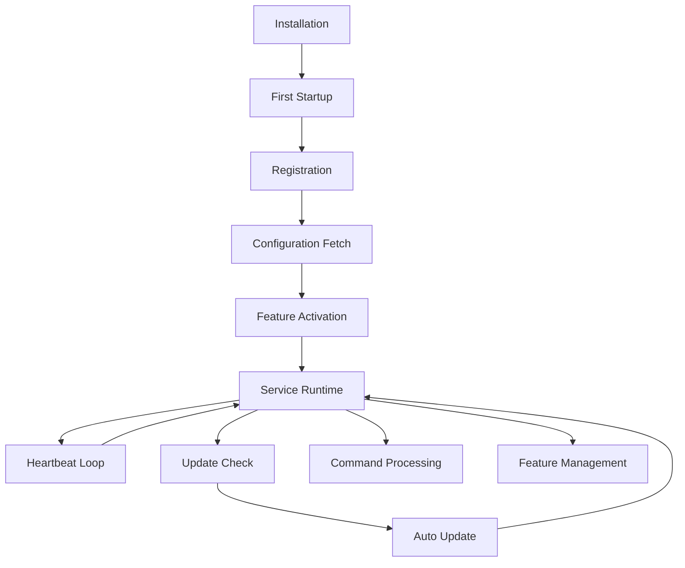

# 🔄 SecureGuard Agent Lifecycle Management

## 🚀 **Complete Agent Lifecycle Overview**

The SecureGuard agent follows a comprehensive lifecycle from installation through operation, with **subscription-based feature management**, **remote command capabilities**, and **dynamic feature control**.

## 📋 **Agent Lifecycle Stages**



## 🎯 **1. Installation Phase**

### **Installer Actions**
```powershell
# During installation, installer:
1. Validates API key against subscription limits
2. Creates service with auto-start configuration
3. Sets Windows registry entries
4. Generates initial config with API key
5. Creates Windows service with system privileges
6. Configures Windows Firewall rules
7. Sets up log rotation and directories
```

### **Registry Setup**
```registry
HKLM\SOFTWARE\SecureGuard\Agent\
├── InstallPath (REG_SZ): "C:\Program Files\SecureGuard\Agent"
├── Version (REG_SZ): "1.0.0"  
├── APIKey (REG_SZ): "sg_abc123_xyz789..."
├── DeviceName (REG_SZ): "Workstation-01"
├── ServerURL (REG_SZ): "https://api.secureguard.com"
├── AutoStart (REG_DWORD): 1
├── UpdateChannel (REG_SZ): "stable"
├── LastUpdate (REG_SZ): "2025-01-15T10:30:00Z"
```

## 🔥 **2. First-Time Startup Workflow**

### **Phase 1: System Integration**
```rust
async fn first_time_startup() -> Result<()> {
    log::info!("🚀 SecureGuard Agent First Startup");
    
    // 1. Configure Windows Service Auto-Start
    setup_windows_service().await?;
    
    // 2. Set Registry Entries
    configure_registry_settings().await?;
    
    // 3. Initialize System Integration
    setup_system_integration().await?;
    
    // 4. Create Hardware Fingerprint
    let hw_fingerprint = generate_hardware_fingerprint().await?;
    
    Ok(())
}

async fn setup_windows_service() -> Result<()> {
    // Configure service for automatic startup
    let service_config = ServiceConfig {
        service_name: "SecureGuardAgent",
        display_name: "SecureGuard Security Agent", 
        description: "SecureGuard endpoint security monitoring service",
        start_type: ServiceStartType::Automatic,
        error_control: ServiceErrorControl::Normal,
        executable_path: get_service_executable_path()?,
        dependencies: vec!["Tcpip".to_string(), "Dnscache".to_string()],
        account: ServiceAccount::LocalSystem,
    };
    
    install_service(service_config).await?;
    start_service("SecureGuardAgent").await?;
    
    log::info!("✅ Windows Service configured with auto-start");
    Ok(())
}
```

### **Phase 2: Server Registration** 
```rust
async fn register_with_server() -> Result<AgentRegistration> {
    log::info!("🔗 Connecting to SecureGuard servers");
    
    // 1. Establish secure connection
    let client = SecureGuardClient::new(&config.server.base_url).await?;
    
    // 2. Register agent with API key
    let registration_request = RegisterAgentRequest {
        api_key: config.agent.api_key.clone(),
        device_name: config.agent.device_name.clone(),
        hardware_fingerprint: get_hardware_fingerprint().await?,
        os_info: collect_os_information().await?,
        version: env!("CARGO_PKG_VERSION").to_string(),
        capabilities: get_agent_capabilities(),
    };
    
    let registration = client.register_agent(registration_request).await?;
    
    // 3. Store agent ID and credentials
    save_agent_credentials(&registration).await?;
    
    log::info!("✅ Agent registered: {}", registration.agent_id);
    Ok(registration)
}
```

### **Phase 3: Configuration Fetch**
```rust
async fn fetch_subscription_config() -> Result<AgentConfig> {
    log::info!("⚙️ Fetching subscription-based configuration");
    
    let agent_id = get_stored_agent_id().await?;
    
    // Fetch config based on user's subscription tier
    let config_response = client.get_agent_config(agent_id).await?;
    
    let subscription_config = AgentConfig {
        // Subscription-based limits
        max_file_scan_size: config_response.limits.max_file_scan_size,
        scan_frequency: config_response.limits.scan_frequency,
        log_retention_days: config_response.limits.log_retention_days,
        
        // Feature flags based on subscription
        features: FeatureSet {
            real_time_monitoring: config_response.features.real_time_monitoring,
            advanced_threat_detection: config_response.features.advanced_threat_detection,
            custom_rules: config_response.features.custom_rules,
            vulnerability_scanning: config_response.features.vulnerability_scanning,
            remote_commands: config_response.features.remote_commands,
            file_integrity_monitoring: config_response.features.file_integrity_monitoring,
            network_monitoring: config_response.features.network_monitoring,
            behavioral_analysis: config_response.features.behavioral_analysis,
        },
        
        // Subscription tier info
        subscription: SubscriptionInfo {
            tier: config_response.subscription.tier,
            plan_name: config_response.subscription.plan_name,
            expires_at: config_response.subscription.expires_at,
            features_enabled: config_response.subscription.features_enabled,
        }
    };
    
    // Save configuration locally
    save_agent_config(&subscription_config).await?;
    
    log::info!("✅ Configuration loaded for {} plan", subscription_config.subscription.plan_name);
    Ok(subscription_config)
}
```

## ⚡ **3. Feature Activation System**

### **Dynamic Feature Loading**
```rust
async fn activate_subscription_features(config: &AgentConfig) -> Result<()> {
    log::info!("🔧 Activating features for {} subscription", config.subscription.plan_name);
    
    let mut active_modules = Vec::new();
    
    // Real-time monitoring (Starter+)
    if config.features.real_time_monitoring {
        let realtime_monitor = RealTimeMonitor::new(&config).await?;
        realtime_monitor.start().await?;
        active_modules.push("RealTimeMonitor");
        log::info!("✅ Real-time monitoring activated");
    }
    
    // Advanced threat detection (Professional+)
    if config.features.advanced_threat_detection {
        let threat_detector = AdvancedThreatDetector::new(&config).await?;
        threat_detector.start().await?;
        active_modules.push("AdvancedThreatDetector");
        log::info!("✅ Advanced threat detection activated");
    }
    
    // Custom security rules (Professional+)
    if config.features.custom_rules {
        let rule_engine = CustomRuleEngine::new(&config).await?;
        rule_engine.load_rules().await?;
        rule_engine.start().await?;
        active_modules.push("CustomRuleEngine");
        log::info!("✅ Custom rules engine activated");
    }
    
    // Vulnerability scanning (Professional+)  
    if config.features.vulnerability_scanning {
        let vuln_scanner = VulnerabilityScanner::new(&config).await?;
        vuln_scanner.start().await?;
        active_modules.push("VulnerabilityScanner");
        log::info!("✅ Vulnerability scanning activated");
    }
    
    // Remote command processing (Professional+)
    if config.features.remote_commands {
        let command_processor = RemoteCommandProcessor::new(&config).await?;
        command_processor.start().await?;
        active_modules.push("RemoteCommandProcessor");
        log::info!("✅ Remote command processing activated");
    }
    
    log::info!("🎯 Activated modules: {}", active_modules.join(", "));
    Ok(())
}
```

## 💓 **4. Runtime Operations**

### **Heartbeat System**
```rust
async fn heartbeat_loop(config: &AgentConfig) -> Result<()> {
    let mut interval = tokio::time::interval(
        Duration::from_secs(config.monitoring.heartbeat_interval)
    );
    
    loop {
        interval.tick().await;
        
        let heartbeat = AgentHeartbeat {
            agent_id: get_agent_id().await?,
            timestamp: Utc::now(),
            status: get_agent_status().await?,
            system_metrics: collect_system_metrics().await?,
            active_features: get_active_features(),
            subscription_status: get_subscription_status().await?,
            last_config_update: get_last_config_update().await?,
            pending_commands: get_pending_command_count().await?,
            version: env!("CARGO_PKG_VERSION").to_string(),
        };
        
        match client.send_heartbeat(heartbeat).await {
            Ok(response) => {
                // Check for config updates
                if response.config_version > get_current_config_version().await? {
                    update_configuration().await?;
                }
                
                // Check for pending commands
                if response.has_pending_commands {
                    process_pending_commands().await?;
                }
                
                // Check for feature updates
                if response.features_changed {
                    reload_features().await?;
                }
                
                log::debug!("💓 Heartbeat successful");
            }
            Err(e) => {
                log::warn!("💔 Heartbeat failed: {}", e);
                handle_connection_failure().await?;
            }
        }
    }
}
```

### **Automatic Updates**
```rust
async fn check_for_updates() -> Result<()> {
    let update_interval = Duration::from_secs(3600); // Check hourly
    let mut interval = tokio::time::interval(update_interval);
    
    loop {
        interval.tick().await;
        
        log::debug!("🔍 Checking for agent updates");
        
        let current_version = Version::parse(env!("CARGO_PKG_VERSION"))?;
        let latest_info = client.get_latest_version().await?;
        let latest_version = Version::parse(&latest_info.version)?;
        
        if latest_version > current_version {
            log::info!("🆕 Update available: {} -> {}", current_version, latest_version);
            
            // Check if auto-update is enabled for subscription tier
            let config = get_agent_config().await?;
            if config.subscription.auto_updates_enabled {
                perform_auto_update(latest_info).await?;
            } else {
                notify_user_of_update(latest_info).await?;
            }
        }
    }
}

async fn perform_auto_update(update_info: UpdateInfo) -> Result<()> {
    log::info!("🚀 Starting automatic update to {}", update_info.version);
    
    // 1. Download update package
    let update_package = download_update(&update_info.download_url).await?;
    
    // 2. Verify digital signature
    verify_update_signature(&update_package, &update_info.signature).await?;
    
    // 3. Stop agent services
    stop_agent_services().await?;
    
    // 4. Backup current installation
    backup_current_installation().await?;
    
    // 5. Install update
    install_update(&update_package).await?;
    
    // 6. Restart services
    restart_agent_services().await?;
    
    // 7. Verify update success
    verify_update_success(&update_info.version).await?;
    
    log::info!("✅ Successfully updated to {}", update_info.version);
    Ok(())
}
```

## 🎛️ **5. Remote Command System (Professional+)**

### **Command Processing Engine**
```rust
#[derive(Debug, Serialize, Deserialize)]
pub enum RemoteCommand {
    // System Information
    GetSystemInfo,
    GetProcessList,
    GetNetworkConnections,
    GetInstalledSoftware,
    
    // File Operations (Pro+ only)
    GetFileHash { path: String },
    GetFileContent { path: String, max_size: usize },
    ListDirectoryContents { path: String },
    FindFiles { pattern: String, path: String },
    
    // Security Operations (Pro+ only)  
    RunVirusScan { path: String },
    CollectForensicData { scope: ForensicScope },
    GetSecurityLogs { hours: u32 },
    
    // Agent Management
    UpdateConfiguration,
    RestartService,
    GetAgentStatus,
    EnableFeature { feature: String },
    DisableFeature { feature: String },
}

async fn process_remote_command(command: RemoteCommand, sender: CommandSender) -> Result<CommandResponse> {
    // Verify sender permissions
    verify_command_permissions(&command, &sender).await?;
    
    log::info!("📨 Processing remote command: {:?} from {}", command, sender.user_id);
    
    let response = match command {
        RemoteCommand::GetSystemInfo => {
            let system_info = collect_detailed_system_info().await?;
            CommandResponse::SystemInfo(system_info)
        }
        
        RemoteCommand::GetFileHash { path } => {
            // Verify user subscription allows file operations
            require_subscription_feature("file_operations").await?;
            
            let hash = calculate_file_hash(&path).await?;
            CommandResponse::FileHash { path, hash }
        }
        
        RemoteCommand::GetFileContent { path, max_size } => {
            // Professional+ feature with size limits
            require_subscription_feature("file_operations").await?;
            verify_file_access_permissions(&path).await?;
            
            let content = read_file_content(&path, max_size).await?;
            CommandResponse::FileContent { path, content, size: content.len() }
        }
        
        RemoteCommand::RunVirusScan { path } => {
            // Professional+ feature
            require_subscription_feature("virus_scanning").await?;
            
            let scan_results = run_virus_scan(&path).await?;
            CommandResponse::ScanResults(scan_results)
        }
        
        RemoteCommand::CollectForensicData { scope } => {
            // Enterprise feature only
            require_subscription_feature("forensic_collection").await?;
            require_role("analyst").await?;
            
            let forensic_data = collect_forensic_evidence(scope).await?;
            CommandResponse::ForensicData(forensic_data)
        }
        
        _ => {
            return Err(SecureGuardError::FeatureNotAvailable(
                "Command not available in current subscription".to_string()
            ));
        }
    };
    
    // Log command execution for audit
    audit_log_command(&command, &sender, &response).await?;
    
    Ok(response)
}
```

### **Analyst Role Permissions**
```rust
#[derive(Debug, Serialize, Deserialize)]
pub struct CommandSender {
    pub user_id: Uuid,
    pub username: String,
    pub role: UserRole,
    pub subscription_tier: String,
    pub permissions: Vec<String>,
}

#[derive(Debug, Serialize, Deserialize)]
pub enum UserRole {
    User,           // Basic commands only
    Admin,          // Full device management
    Analyst,        // Security analysis commands
    SystemAdmin,    // All commands including forensics
}

async fn verify_command_permissions(command: &RemoteCommand, sender: &CommandSender) -> Result<()> {
    // Check subscription tier requirements
    let required_tier = match command {
        RemoteCommand::GetSystemInfo | RemoteCommand::GetAgentStatus => "free",
        RemoteCommand::GetFileHash { .. } | RemoteCommand::GetProcessList => "starter", 
        RemoteCommand::GetFileContent { .. } | RemoteCommand::RunVirusScan { .. } => "professional",
        RemoteCommand::CollectForensicData { .. } => "enterprise",
        _ => "professional",
    };
    
    if !subscription_tier_allows(&sender.subscription_tier, required_tier) {
        return Err(SecureGuardError::SubscriptionLimitExceeded(
            format!("Command requires {} subscription or higher", required_tier)
        ));
    }
    
    // Check role permissions  
    let allowed = match command {
        RemoteCommand::GetSystemInfo | RemoteCommand::GetAgentStatus => true,
        RemoteCommand::GetFileContent { .. } | RemoteCommand::GetFileHash { .. } => {
            matches!(sender.role, UserRole::Admin | UserRole::Analyst | UserRole::SystemAdmin)
        }
        RemoteCommand::CollectForensicData { .. } => {
            matches!(sender.role, UserRole::Analyst | UserRole::SystemAdmin)
        }
        RemoteCommand::RestartService => {
            matches!(sender.role, UserRole::Admin | UserRole::SystemAdmin)
        }
        _ => matches!(sender.role, UserRole::SystemAdmin),
    };
    
    if !allowed {
        return Err(SecureGuardError::AuthorizationFailed);
    }
    
    Ok(())
}
```

## 🧩 **6. Dynamic Feature Management System**

### **Feature Registry**
```rust
#[derive(Debug, Serialize, Deserialize)]
pub struct AgentFeature {
    pub feature_id: String,
    pub name: String,
    pub description: String,
    pub version: String,
    pub required_subscription: String,
    pub required_agent_version: String,
    pub dependencies: Vec<String>,
    pub configuration_schema: serde_json::Value,
    pub is_enabled: bool,
    pub auto_enable: bool,
}

pub struct FeatureManager {
    available_features: HashMap<String, AgentFeature>,
    active_features: HashMap<String, Box<dyn FeatureModule>>,
    config: Arc<AgentConfig>,
}

impl FeatureManager {
    pub async fn new(config: Arc<AgentConfig>) -> Result<Self> {
        let mut manager = Self {
            available_features: HashMap::new(),
            active_features: HashMap::new(),
            config,
        };
        
        // Register built-in features
        manager.register_builtin_features().await?;
        
        // Load features from server
        manager.sync_features_from_server().await?;
        
        Ok(manager)
    }
    
    async fn register_builtin_features(&mut self) -> Result<()> {
        // Real-time monitoring
        self.register_feature(AgentFeature {
            feature_id: "realtime_monitoring".to_string(),
            name: "Real-time Security Monitoring".to_string(),
            description: "Continuous monitoring of system activities and security events".to_string(),
            version: "1.0.0".to_string(),
            required_subscription: "starter".to_string(),
            required_agent_version: "1.0.0".to_string(),
            dependencies: vec![],
            configuration_schema: json!({
                "scan_interval": {"type": "integer", "default": 30},
                "alert_threshold": {"type": "string", "default": "medium"}
            }),
            is_enabled: false,
            auto_enable: true,
        });
        
        // Advanced threat detection
        self.register_feature(AgentFeature {
            feature_id: "advanced_threat_detection".to_string(),
            name: "Advanced Threat Detection".to_string(), 
            description: "AI-powered behavioral analysis and threat detection".to_string(),
            version: "1.0.0".to_string(),
            required_subscription: "professional".to_string(),
            required_agent_version: "1.0.0".to_string(),
            dependencies: vec!["realtime_monitoring".to_string()],
            configuration_schema: json!({
                "ai_model": {"type": "string", "default": "standard"},
                "sensitivity": {"type": "string", "default": "balanced"}
            }),
            is_enabled: false,
            auto_enable: true,
        });
        
        // File integrity monitoring
        self.register_feature(AgentFeature {
            feature_id: "file_integrity_monitoring".to_string(),
            name: "File Integrity Monitoring".to_string(),
            description: "Monitor critical files for unauthorized changes".to_string(),
            version: "1.0.0".to_string(),
            required_subscription: "professional".to_string(),
            required_agent_version: "1.0.0".to_string(),
            dependencies: vec![],
            configuration_schema: json!({
                "watch_paths": {"type": "array", "default": ["C:\\Windows\\System32"]},
                "check_interval": {"type": "integer", "default": 300}
            }),
            is_enabled: false,
            auto_enable: false, // User must explicitly enable
        });
        
        log::info!("✅ Registered {} built-in features", self.available_features.len());
        Ok(())
    }
    
    pub async fn enable_feature(&mut self, feature_id: &str) -> Result<()> {
        let feature = self.available_features.get(feature_id)
            .ok_or_else(|| SecureGuardError::NotFound(format!("Feature '{}' not found", feature_id)))?;
        
        // Verify subscription access
        if !subscription_allows_feature(&self.config.subscription.tier, &feature.required_subscription) {
            return Err(SecureGuardError::FeatureNotAvailable(
                format!("Feature '{}' requires {} subscription", feature.name, feature.required_subscription)
            ));
        }
        
        // Check dependencies
        for dep in &feature.dependencies {
            if !self.active_features.contains_key(dep) {
                self.enable_feature(dep).await?;
            }
        }
        
        // Load and start feature module
        let feature_module = self.load_feature_module(feature).await?;
        feature_module.start().await?;
        
        self.active_features.insert(feature_id.to_string(), feature_module);
        
        log::info!("✅ Enabled feature: {}", feature.name);
        Ok(())
    }
    
    pub async fn disable_feature(&mut self, feature_id: &str) -> Result<()> {
        if let Some(feature_module) = self.active_features.remove(feature_id) {
            feature_module.stop().await?;
            log::info!("🔌 Disabled feature: {}", feature_id);
        }
        Ok(())
    }
    
    async fn sync_features_from_server(&mut self) -> Result<()> {
        log::info!("🔄 Syncing features from server");
        
        let server_features = self.fetch_server_features().await?;
        
        for feature in server_features {
            // Add or update feature
            self.available_features.insert(feature.feature_id.clone(), feature);
        }
        
        // Auto-enable features based on subscription
        self.auto_enable_subscription_features().await?;
        
        Ok(())
    }
    
    async fn auto_enable_subscription_features(&mut self) -> Result<()> {
        let features_to_enable: Vec<String> = self.available_features
            .values()
            .filter(|f| f.auto_enable && subscription_allows_feature(&self.config.subscription.tier, &f.required_subscription))
            .map(|f| f.feature_id.clone())
            .collect();
        
        for feature_id in features_to_enable {
            if let Err(e) = self.enable_feature(&feature_id).await {
                log::warn!("Failed to auto-enable feature {}: {}", feature_id, e);
            }
        }
        
        Ok(())
    }
}
```

### **Feature Development API**
```rust
// API for developers to add new features
#[async_trait]
pub trait FeatureModule: Send + Sync {
    async fn start(&self) -> Result<()>;
    async fn stop(&self) -> Result<()>;
    async fn get_status(&self) -> Result<FeatureStatus>;
    async fn handle_config_update(&self, config: serde_json::Value) -> Result<()>;
    async fn get_metrics(&self) -> Result<FeatureMetrics>;
}

// Example: Custom vulnerability scanner feature
pub struct VulnerabilityScanner {
    config: VulnScannerConfig,
    is_running: Arc<AtomicBool>,
    scan_scheduler: Option<JoinHandle<()>>,
}

#[async_trait]
impl FeatureModule for VulnerabilityScanner {
    async fn start(&self) -> Result<()> {
        log::info!("🔍 Starting Vulnerability Scanner");
        
        self.is_running.store(true, Ordering::SeqCst);
        
        // Start scheduled vulnerability scans
        let scanner = self.clone();
        let handle = tokio::spawn(async move {
            scanner.run_scan_loop().await;
        });
        
        // Store handle for cleanup
        // self.scan_scheduler = Some(handle);
        
        Ok(())
    }
    
    async fn stop(&self) -> Result<()> {
        log::info!("⏹️ Stopping Vulnerability Scanner");
        
        self.is_running.store(false, Ordering::SeqCst);
        
        if let Some(handle) = self.scan_scheduler.take() {
            handle.abort();
        }
        
        Ok(())
    }
    
    async fn get_status(&self) -> Result<FeatureStatus> {
        Ok(FeatureStatus {
            is_active: self.is_running.load(Ordering::SeqCst),
            last_activity: self.get_last_scan_time().await?,
            metrics: self.get_scan_metrics().await?,
        })
    }
}
```

## 📊 **7. Management Dashboard Integration**

### **Agent Status API**
```rust
#[derive(Serialize, Deserialize)]
pub struct AgentStatusResponse {
    pub agent_id: Uuid,
    pub device_name: String,
    pub status: AgentStatus,
    pub last_heartbeat: DateTime<Utc>,
    pub version: String,
    pub subscription_tier: String,
    pub active_features: Vec<String>,
    pub system_metrics: SystemMetrics,
    pub pending_commands: u32,
    pub uptime: Duration,
    pub last_update_check: DateTime<Utc>,
}

// GET /api/v1/agents/{agent_id}/status  
pub async fn get_agent_status(agent_id: Uuid) -> Result<AgentStatusResponse> {
    let agent = agent_service.find_by_id(agent_id).await?;
    let subscription = subscription_service.get_user_subscription(agent.user_id).await?;
    
    Ok(AgentStatusResponse {
        agent_id: agent.agent_id,
        device_name: agent.device_name.unwrap_or_else(|| "Unknown".to_string()),
        status: agent.status,
        last_heartbeat: agent.last_heartbeat.unwrap_or(agent.created_at),
        version: agent.version,
        subscription_tier: subscription.plan.plan_name,
        active_features: get_agent_active_features(agent_id).await?,
        system_metrics: get_latest_system_metrics(agent_id).await?,
        pending_commands: get_pending_command_count(agent_id).await?,
        uptime: calculate_agent_uptime(agent_id).await?,
        last_update_check: get_last_update_check(agent_id).await?,
    })
}
```

## 🔄 **8. Configuration Update Flow**

### **Dynamic Config Updates**
```rust
async fn handle_config_update(new_config: AgentConfig) -> Result<()> {
    log::info!("🔄 Processing configuration update");
    
    let current_config = get_current_config().await?;
    
    // Compare subscription tiers
    if new_config.subscription.tier != current_config.subscription.tier {
        log::info!("📊 Subscription tier changed: {} -> {}", 
            current_config.subscription.tier, new_config.subscription.tier);
        
        // Update feature availability
        update_feature_availability(&new_config).await?;
    }
    
    // Compare enabled features
    let old_features: HashSet<_> = current_config.features.enabled_features.into_iter().collect();
    let new_features: HashSet<_> = new_config.features.enabled_features.into_iter().collect();
    
    // Enable new features
    for feature in new_features.difference(&old_features) {
        enable_feature(feature).await?;
    }
    
    // Disable removed features  
    for feature in old_features.difference(&new_features) {
        disable_feature(feature).await?;
    }
    
    // Update configuration
    save_agent_config(&new_config).await?;
    
    // Notify modules of config change
    broadcast_config_update(&new_config).await?;
    
    log::info!("✅ Configuration update completed");
    Ok(())
}
```

## 🏗️ **Implementation Architecture**

### **Service Structure**
```
SecureGuardAgent/
├── Core/
│   ├── AgentCore (main orchestrator)
│   ├── ConfigManager (subscription-aware config)
│   ├── FeatureManager (dynamic feature loading)
│   └── UpdateManager (automatic updates)
├── Communication/
│   ├── HeartbeatService (regular server sync)
│   ├── CommandProcessor (remote commands)  
│   └── ConfigSyncService (config updates)
├── Features/ (pluggable modules)
│   ├── RealTimeMonitor
│   ├── ThreatDetector
│   ├── VulnerabilityScanner
│   ├── FileIntegrityMonitor
│   └── ForensicCollector
├── System/
│   ├── WindowsService (service lifecycle)
│   ├── RegistryManager (Windows registry)
│   └── UpdaterService (self-update capability)
└── Security/
    ├── AuthManager (server authentication)
    ├── EncryptionService (secure communications)
    └── PermissionManager (feature access control)
```

---

## 🎯 **Key Business Benefits**

### **For Users**
- **Automatic Setup**: Professional installation and configuration
- **Seamless Updates**: Zero-downtime automatic updates
- **Feature Growth**: New capabilities delivered automatically  
- **Professional Support**: Remote assistance via secure commands

### **For Analysts**
- **Remote Investigation**: Fetch files and hashes directly
- **Real-time Response**: Execute security commands remotely
- **Forensic Collection**: Gather evidence without site visits
- **Subscription Gating**: Professional features justify premium pricing

### **For Developers**
- **Plugin Architecture**: Easy to add new features
- **Feature Flags**: Gradual feature rollout capability
- **Subscription Integration**: Business model enforcement
- **Update Pipeline**: Continuous deployment ready

**🚀 This comprehensive agent lifecycle creates a professional, scalable, and monetizable endpoint security platform that grows with your users' needs!**